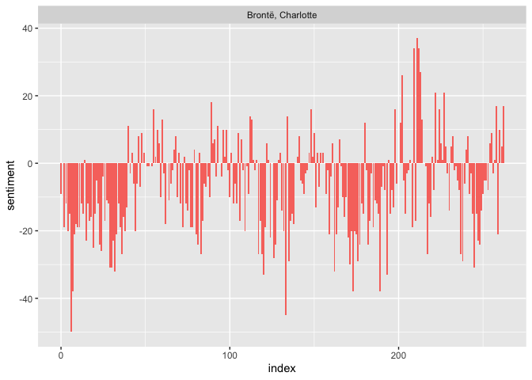
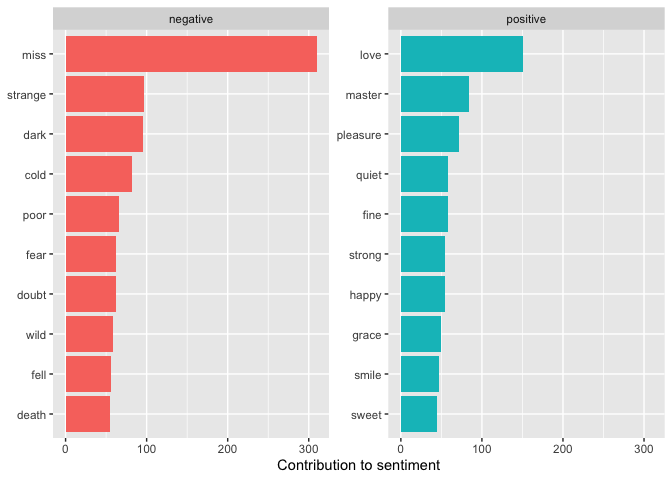
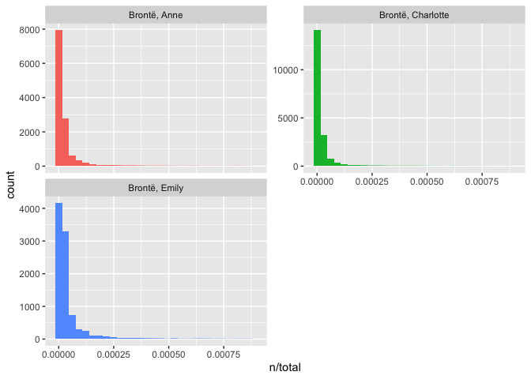
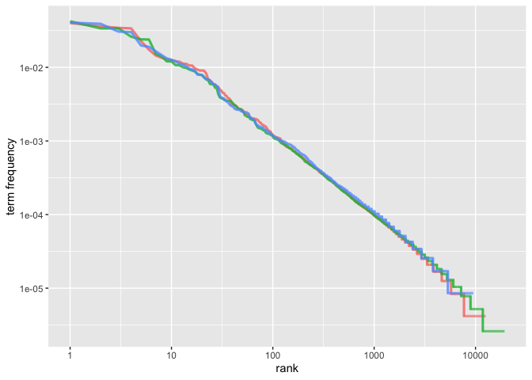
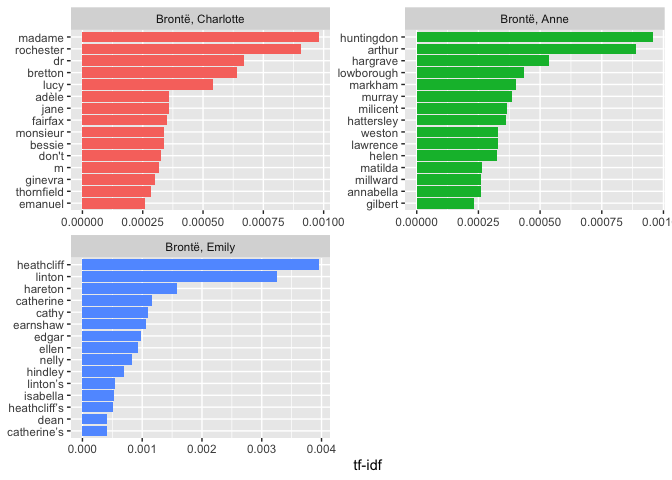

My project is text analysis. For this project, I am using five books
from The Bronte sisters. I am using the gutenbergr package to access
these books.

‘Jane Eyre’ is one of my favorite books. I thought it would be
interesting to use a text analysis to get another perspective on one of
my favorites. I investigate the most common positive and negative words
and score positive and negative sentiment. I also use TF-IDF to
investigate how relevant a word is to a parts of the book. I use some
tables and figures to explain and show the results.

**Sentiment analysis**

I am analyzing the book ’ Jane Eyre’. First, I will need to convert the
text to a form that easy to use. The output is one token per word.

    ## Determining mirror for Project Gutenberg from http://www.gutenberg.org/robot/harvest

    ## Using mirror http://aleph.gutenberg.org

    ## # A tibble: 188,399 x 5
    ##    gutenberg_id author            linenumber chapter word         
    ##           <int> <chr>                  <int>   <int> <chr>        
    ##  1         1260 Brontë, Charlotte          1       0 jane         
    ##  2         1260 Brontë, Charlotte          1       0 eyre         
    ##  3         1260 Brontë, Charlotte          2       0 an           
    ##  4         1260 Brontë, Charlotte          2       0 autobiography
    ##  5         1260 Brontë, Charlotte          4       0 by           
    ##  6         1260 Brontë, Charlotte          4       0 charlotte    
    ##  7         1260 Brontë, Charlotte          4       0 brontë       
    ##  8         1260 Brontë, Charlotte          6       0 _illustrated 
    ##  9         1260 Brontë, Charlotte          6       0 by           
    ## 10         1260 Brontë, Charlotte          6       0 f            
    ## # … with 188,389 more rows

The output has a lot of common words that don’t contribute meaning to
the book. So I need to filter out the stop-words. After filter out the
stop words, here are the most common words from this book—order from
high to low are: (n means how many times the word is used)

    ## Joining, by = "word"

    ## # A tibble: 12,309 x 2
    ##    word          n
    ##    <chr>     <int>
    ##  1 jane        341
    ##  2 rochester   317
    ##  3 sir         316
    ##  4 miss        310
    ##  5 time        244
    ##  6 day         232
    ##  7 looked      221
    ##  8 night       218
    ##  9 eyes        187
    ## 10 john        184
    ## # … with 12,299 more rows

I am using ‘nrc’ lexicon here. This lexicon is categorizes words in a
binary fashion into categories of positive, negative, anger,
anticipation, disgust, fear, joy, sadness, surprise, and trust.. Here is
the most common ’ fear’ words in the book ‘Jane Eyre’.

    ## Joining, by = "word"

    ## # A tibble: 675 x 2
    ##    word        n
    ##    <chr>   <int>
    ##  1 fire      122
    ##  2 god        96
    ##  3 feeling    67
    ##  4 doubt      62
    ##  5 fear       62
    ##  6 death      55
    ##  7 marry      49
    ##  8 change     41
    ##  9 bear       40
    ## 10 die        38
    ## # … with 665 more rows

Here is the most common ‘joy’ words in the book ‘Jane Eyre’.

    ## Joining, by = "word"

    ## # A tibble: 410 x 2
    ##    word        n
    ##    <chr>   <int>
    ##  1 good      237
    ##  2 love      151
    ##  3 found     126
    ##  4 god        96
    ##  5 child      88
    ##  6 young      81
    ##  7 hope       75
    ##  8 white      73
    ##  9 feeling    67
    ## 10 present    65
    ## # … with 400 more rows

    ## Joining, by = "word"

Here I can plot these sentiment scores of ‘Jane Eyre’. We can see the
changes in the sentiment over the story from the image. I have read this
book many times, and I remember the storyline. At the beginning of the
book, Jane lost her parents, and her cousins and aunt bully her. From
the image, we can see lots of negative sentiment. At the end of the
story, Jane inherited some money and married the man she loves. There is
a more positive sentiment at the end of the story from the image.

    ggplot(bronte_sentiment, aes(index, sentiment, fill = author)) +
      geom_col(show.legend = FALSE) +
      facet_wrap(~author, ncol = 2, scales = "free_x")

Here are the most common positive words and the most common negative
words in ‘Jane Eyre’.

    ## Joining, by = "word"

    ## # A tibble: 2,326 x 3
    ##    word     sentiment     n
    ##    <chr>    <chr>     <int>
    ##  1 miss     negative    310
    ##  2 love     positive    151
    ##  3 strange  negative     97
    ##  4 dark     negative     95
    ##  5 master   positive     84
    ##  6 cold     negative     82
    ##  7 pleasure positive     72
    ##  8 poor     negative     66
    ##  9 doubt    negative     62
    ## 10 fear     negative     62
    ## # … with 2,316 more rows

Here is the visualization of the most common positive and negative words

    bing_word_counts %>%
      group_by(sentiment) %>%
      slice_max(n, n = 10) %>%
      ungroup() %>%
      mutate(word = reorder(word, n)) %>%
      ggplot(aes(n, word, fill = sentiment)) +
      geom_col(show.legend = FALSE) +
      facet_wrap(~sentiment, scales = "free_y") +
      labs(x = "Contribution to sentiment", y = NULL)

Interestingly, ‘miss’ as a negative sentiment shows 310 times in this
book. This word more likely means young lady during that time; writers
use a lot of ‘miss’ in the book. Maybe ‘miss’ should be the ’stop-words
in Books in this era.

# frequency analysis: tf-idf

Here are the most commonly used words in these five books from the
Bronte Sisters.(n:how many times that word is used in the book. total:
total number of words in the book)

    ## Joining, by = "author"

    ## # A tibble: 41,382 x 4
    ##    author            word      n  total
    ##    <chr>             <chr> <int>  <int>
    ##  1 Brontë, Charlotte the   16261 384914
    ##  2 Brontë, Charlotte and   13038 384914
    ##  3 Brontë, Charlotte i     13030 384914
    ##  4 Brontë, Charlotte to    10039 384914
    ##  5 Brontë, Anne      and    9592 239893
    ##  6 Brontë, Charlotte of     9237 384914
    ##  7 Brontë, Charlotte a      9190 384914
    ##  8 Brontë, Anne      the    8660 239893
    ##  9 Brontë, Anne      i      8243 239893
    ## 10 Brontë, Anne      to     8123 239893
    ## # … with 41,372 more rows

Here is the data visualization of the distribution of n/total for each
book:

    ## `stat_bin()` using `bins = 30`. Pick better value with `binwidth`.

These figures show the long tailed distributions. Those words on the
tail parts are very rare words.

Zipf’s law states that the frequency that a word appears is inversely
proportional to its rank. Examining Zipf’s law for these books. (rank:
the rank of each word within the frequency table)

    ## # A tibble: 41,382 x 6
    ##    author            word      n  total  rank `term frequency`
    ##    <chr>             <chr> <int>  <int> <int>            <dbl>
    ##  1 Brontë, Charlotte the   16261 384914     1           0.0422
    ##  2 Brontë, Charlotte and   13038 384914     2           0.0339
    ##  3 Brontë, Charlotte i     13030 384914     3           0.0339
    ##  4 Brontë, Charlotte to    10039 384914     4           0.0261
    ##  5 Brontë, Anne      and    9592 239893     1           0.0400
    ##  6 Brontë, Charlotte of     9237 384914     5           0.0240
    ##  7 Brontë, Charlotte a      9190 384914     6           0.0239
    ##  8 Brontë, Anne      the    8660 239893     2           0.0361
    ##  9 Brontë, Anne      i      8243 239893     3           0.0344
    ## 10 Brontë, Anne      to     8123 239893     4           0.0339
    ## # … with 41,372 more rows

 Zipf’s
law is often visualized by plotting rank on the x-axis and term
frequency on the y-axis, on logarithmic scales. Plotting this way, an
inversely proportional relationship will have a constant, negative
slope.From the figure above we can see the relationship between rank and
frequency have negative slope. These books are not to far from each
other.

The table below shows word frequency order from high to low.

    ## # A tibble: 41,382 x 7
    ##    author            word      n  total     tf   idf tf_idf
    ##    <chr>             <chr> <int>  <int>  <dbl> <dbl>  <dbl>
    ##  1 Brontë, Charlotte the   16261 384914 0.0422     0      0
    ##  2 Brontë, Charlotte and   13038 384914 0.0339     0      0
    ##  3 Brontë, Charlotte i     13030 384914 0.0339     0      0
    ##  4 Brontë, Charlotte to    10039 384914 0.0261     0      0
    ##  5 Brontë, Anne      and    9592 239893 0.0400     0      0
    ##  6 Brontë, Charlotte of     9237 384914 0.0240     0      0
    ##  7 Brontë, Charlotte a      9190 384914 0.0239     0      0
    ##  8 Brontë, Anne      the    8660 239893 0.0361     0      0
    ##  9 Brontë, Anne      i      8243 239893 0.0344     0      0
    ## 10 Brontë, Anne      to     8123 239893 0.0339     0      0
    ## # … with 41,372 more rows

The table below shows words with high tf-idf.

    ## # A tibble: 41,382 x 6
    ##    author            word           n       tf   idf   tf_idf
    ##    <chr>             <chr>      <int>    <dbl> <dbl>    <dbl>
    ##  1 Brontë, Emily     heathcliff   421 0.00360  1.10  0.00395 
    ##  2 Brontë, Emily     linton       346 0.00296  1.10  0.00325 
    ##  3 Brontë, Emily     hareton      169 0.00144  1.10  0.00159 
    ##  4 Brontë, Emily     catherine    336 0.00287  0.405 0.00116 
    ##  5 Brontë, Emily     cathy        117 0.000999 1.10  0.00110 
    ##  6 Brontë, Emily     earnshaw     114 0.000974 1.10  0.00107 
    ##  7 Brontë, Charlotte madame       343 0.000891 1.10  0.000979
    ##  8 Brontë, Emily     edgar        104 0.000888 1.10  0.000976
    ##  9 Brontë, Anne      huntingdon   209 0.000871 1.10  0.000957
    ## 10 Brontë, Emily     ellen         99 0.000846 1.10  0.000929
    ## # … with 41,372 more rows

From last two tables we can see that very common words’ idf, tf-idf are
zero. The high tf-idf words are not very common, but they are important
to these books.

Here is the data-visualization of these words with high tf-idf:

    plot_bronte <- bronte_words %>%
      bind_tf_idf(word, author, n) %>%
      mutate(author = factor(author, levels = c("Brontë, Charlotte",
                                                "Brontë, Anne",
                                                "Brontë, Emily")))

    plot_bronte %>%
      group_by(author) %>%
      slice_max(tf_idf, n = 15) %>% 
      ungroup() %>%
      mutate(word = reorder(word, tf_idf)) %>%
      ggplot(aes(tf_idf, word, fill = author)) +
      geom_col(show.legend = FALSE) +
      labs(x = "tf-idf", y = NULL) +
      facet_wrap(~author, ncol = 2, scales = "free")

**words relationship by using n-grams**

Here I want to see whats the most common bigrams in the bronte’s books.

    ## # A tibble: 253,275 x 2
    ##    bigram     n
    ##    <chr>  <int>
    ##  1 <NA>   16213
    ##  2 of the  2542
    ##  3 in the  2139
    ##  4 to the  1563
    ##  5 i was   1494
    ##  6 and i   1431
    ##  7 i had   1431
    ##  8 it was  1380
    ##  9 to be   1304
    ## 10 on the  1142
    ## # … with 253,265 more rows

The table below is the most common b-gram words without stop-words.

Find the most common bigrams from these books:

    ## # A tibble: 49,757 x 3
    ##    word1     word2            n
    ##    <chr>     <chr>        <int>
    ##  1 <NA>      <NA>         16213
    ##  2 dr        john           125
    ##  3 st        john           121
    ##  4 madame    beck           103
    ##  5 miss      grey            71
    ##  6 dr        bretton         61
    ##  7 wuthering heights         59
    ##  8 de        bassompierre    52
    ##  9 miss      murray          50
    ## 10 miss      temple          49
    ## # … with 49,747 more rows

The table below shows the bigrams with high tf-idf.

    ## # A tibble: 51,263 x 6
    ##    author            bigram                 n      tf   idf  tf_idf
    ##    <chr>             <chr>              <int>   <dbl> <dbl>   <dbl>
    ##  1 Brontë, Anne      miss grey             71 0.00355 1.10  0.00390
    ##  2 Brontë, Charlotte dr john              125 0.00299 1.10  0.00328
    ##  3 Brontë, Anne      miss murray           50 0.00250 1.10  0.00274
    ##  4 Brontë, Charlotte madame beck          103 0.00246 1.10  0.00270
    ##  5 Brontë, Emily     miss cathy            28 0.00235 1.10  0.00258
    ##  6 Brontë, Emily     miss catherine        26 0.00218 1.10  0.00240
    ##  7 Brontë, Anne      lord lowborough       41 0.00205 1.10  0.00225
    ##  8 Brontë, Emily     wuthering heights     57 0.00478 0.405 0.00194
    ##  9 Brontë, Emily     thrushcross grange    20 0.00168 1.10  0.00184
    ## 10 Brontë, Charlotte dr bretton            61 0.00146 1.10  0.00160
    ## # … with 51,253 more rows

We can see ‘tf-idf’ is intended to measure how important a word is to a
book in a collection of books.
